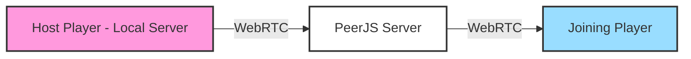

## Overview

Minecraft Web Client supports **peer-to-peer (P2P) multiplayer** powered by PeerJS, allowing you to share your singleplayer world with friends over the internet without setting up a dedicated server. Open your world to WAN and send a join link to anyone!

<Note>
From the README: "Play with friends over internet! (P2P is powered by Peer.js discovery servers)"
</Note>

## How P2P Works



1. **Host** opens their singleplayer world to WAN
2. **PeerJS discovery server** coordinates the connection
3. **WebRTC** establishes direct peer-to-peer connection
4. **Players** communicate directly without a proxy

## Opening Your World to WAN

<Steps>
  <Step title="Load a Singleplayer World">
    Start or load any singleplayer world. You must have an active local server running.
  </Step>

  <Step title="Open to WAN">
    In the game chat, type:
    ```
    /publish
    ```
    
    Or use the console:
    ```javascript
    await openToWanAndCopyJoinLink((text) => console.log(text))
    ```
  </Step>

  <Step title="Share the Join Link">
    The join link is automatically copied to your clipboard. Share it with friends:
    
    ```
    https://mcraft.fun/?connectPeer=<peer-id>&peerVersion=1.21.4
    ```
    
    Your friends can click this link to join your world directly!
  </Step>

  <Step title="Wait for Connections">
    When friends click the link, they'll automatically connect to your world. You'll see them join in the chat.
  </Step>
</Steps>

## Join Link Format

From `src/localServerMultiplayer.ts:25-38`:

```typescript
export const getJoinLink = () => {
  if (!peerInstance) return
  const url = new URL(window.location.href)
  for (const key of url.searchParams.keys()) {
    url.searchParams.delete(key)
  }
  url.searchParams.set('connectPeer', peerInstance.id)
  url.searchParams.set('peerVersion', localServer!.options.version)
  const host = (overridePeerJsServer ?? miscUiState.appConfig?.peerJsServer) ?? undefined
  if (host) {
    url.searchParams.set('server', host)
  }
  return url.toString()
}
```

The join link contains:
- `connectPeer`: Unique peer ID
- `peerVersion`: Minecraft version
- `server`: PeerJS server (optional)

## Connecting to a Friend's World

<Steps>
  <Step title="Get the Join Link">
    Ask your friend for their join link from the `/publish` command.
  </Step>

  <Step title="Click the Link">
    Simply click the join link. The game will:
    1. Connect to the PeerJS server
    2. Establish WebRTC connection
    3. Join the world automatically
  </Step>

  <Step title="Wait for Connection">
    You'll see:
    - "Connecting to peer server"
    - "Connecting to the peer"
    - Then you'll spawn in the world!
  </Step>
</Steps>

## PeerJS Configuration

The client uses PeerJS with automatic fallback servers.

From `src/localServerMultiplayer.ts:59-64`:

```typescript
const host = (overridePeerJsServer ?? miscUiState.appConfig?.peerJsServer) || undefined
const params = host ? parseUrl(host) : undefined
const peer = new Peer({
  debug: 3,
  secure: true,
  ...params
})
```

### Custom PeerJS Server

You can specify a custom PeerJS server:

```javascript
// In config.json
{
  "peerJsServer": "your-server.com:9000/myapp",
  "peerJsServerFallback": "fallback-server.com:9000/myapp"
}
```

Or via URL parameter:
```
?server=your-server.com:9000/myapp
```

## Connection Lifecycle

From `src/localServerMultiplayer.ts:66-97`:

```typescript
peer.on('connection', (connection) => {
  console.log('connection')
  const serverDuplex = new CustomDuplex({}, async (data) => connection.send(data))
  const client = new Client(true, localServer.options.version, undefined)
  client.setSocket(serverDuplex)
  localServer._server.emit('connection', client)

  connection.on('data', (data: any) => {
    serverDuplex.push(Buffer.from(data))
  })
  
  // Handle disconnection
  const endConnection = () => {
    console.log('connection.close')
    serverDuplex.end()
    connection.close()
  }
  serverDuplex.on('end', endConnection)
  serverDuplex.on('force-close', endConnection)
  client.on('end', endConnection)

  const disconnected = () => {
    serverDuplex.end()
    client.end()
  }
  connection.on('iceStateChanged', (state) => {
    if (state === 'disconnected') {
      disconnected()
    }
  })
  connection.on('close', disconnected)
  connection.on('error', disconnected)
})
```

## Closing WAN

To stop accepting connections:

```javascript
closeWan()
// Returns: 'Closed WAN'
```

From `src/localServerMultiplayer.ts:171-176`:

```typescript
export const closeWan = () => {
  peerInstance?.destroy()
  peerInstance = undefined
  miscUiState.wanOpened = false
  return 'Closed WAN'
}
```

## Troubleshooting

### Connection Timeout

If connection times out (6 seconds), the client automatically tries the fallback server:

```typescript
timeout = setTimeout(async () => {
  if (!hadErrorReported && timeout !== undefined) {
    if (hasFallback && overridePeerJsServer === null) {
      destroy()
      overridePeerJsServer = fallbackServer
      console.log('Trying fallback server due to timeout', fallbackServer)
      resolve((await openToWanAndCopyJoinLink(writeText, doCopy))!)
    } else {
      writeText('timeout')
      resolve('Failed to open to wan (timeout)')
    }
  }
}, 6000)
```

### Common Issues

<AccordionGroup>
  <Accordion title="Failed to open to WAN">
    **Causes**:
    - PeerJS server is down
    - Network firewall blocking WebRTC
    - Browser doesn't support WebRTC

    **Solutions**:
    - Wait for automatic fallback server (6 seconds)
    - Check browser console for errors
    - Try different browser (Chrome/Firefox recommended)
    - Disable VPN or restrictive firewall
  </Accordion>

  <Accordion title="Connection drops immediately">
    **Causes**:
    - ICE connection failed
    - NAT traversal issues
    - Network instability

    **Solutions**:
    - Both players should have stable internet
    - Try connecting again
    - Check if router supports WebRTC
    - Consider using a TURN server
  </Accordion>

  <Accordion title="Join link not copying">
    **Causes**:
    - Browser clipboard permissions denied
    - Running in non-secure context (HTTP)

    **Solutions**:
    - Allow clipboard access in browser settings
    - Use HTTPS version of the site
    - Manually copy from prompt dialog
  </Accordion>

  <Accordion title="Version mismatch error">
    **Cause**: Host and joining player have different Minecraft versions

    **Solution**: Both players must use the same version (specified in join link)
  </Accordion>
</AccordionGroup>

## Advanced Features

### State Tracking

```javascript
// Check if WAN is opened
miscUiState.wanOpened // true/false

// Check if opening in progress
miscUiState.wanOpening // true/false
```

### Manual Connection

Connect to a peer directly:

```javascript
const duplex = await connectToPeer('peer-id-here', {
  server: 'custom-server.com:9000' // optional
})
```

From `src/localServerMultiplayer.ts:182-229`.

### Custom Duplex Stream

P2P uses a custom duplex stream to bridge WebRTC and Minecraft protocol:

```typescript
class CustomDuplex extends Duplex {
  constructor (options, public writeAction) {
    super(options)
  }

  _read () { }

  _write (chunk, encoding, callback) {
    this.writeAction(chunk)
    callback()
  }
}
```

Data flows:
- **Outgoing**: Minecraft packets → `writeAction` → WebRTC data channel
- **Incoming**: WebRTC data channel → `push()` → Minecraft client

## Performance Considerations

### Latency

P2P connections are typically **faster** than proxy connections:
- Direct peer-to-peer reduces hops
- No server-side packet processing
- WebRTC optimizes for real-time data

**Typical latency**:
- Same region: 10-40ms
- Different regions: 100-200ms
- Intercontinental: 200-400ms

### Bandwidth

The host's upload bandwidth limits how many players can join:
- **1 player**: ~100 KB/s
- **2-3 players**: ~300 KB/s
- **4+ players**: 500+ KB/s

<Warning>
Mobile hotspots and cellular networks may have strict upload limits or block WebRTC entirely.
</Warning>

## Security Notes

- **Direct connection**: Players connect directly to your browser, not your IP
- **No port forwarding**: WebRTC handles NAT traversal automatically
- **Encrypted**: WebRTC uses DTLS encryption
- **Peer ID**: Temporary and changes each session

## Limitations

1. **Host must stay online**: If the host closes the game, all players disconnect
2. **No persistence**: World state is not synchronized; only host has the world
3. **Browser-based**: Both host and players must use the web client
4. **NAT traversal**: May not work on extremely restrictive networks

## Query Parameters

### Hosting

No special parameters needed - use `/publish` in-game.

### Joining

- `?connectPeer=<peer-id>` - Peer to connect to
- `?peerVersion=<version>` - Minecraft version
- `?server=<server>` - Custom PeerJS server

Example:
```
https://mcraft.fun/?connectPeer=abc123&peerVersion=1.21.4&server=peer.example.com:9000
```

## See Also

- [Multiplayer](/guides/multiplayer) - Connecting to regular servers
- [Singleplayer](/guides/singleplayer) - Creating local worlds
- [Servers & Proxy](/deployment/proxy) - Setting up proxy servers