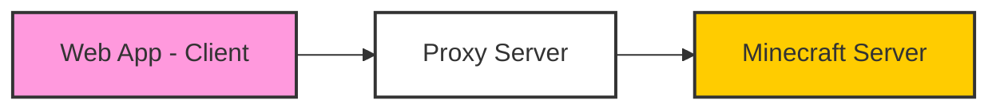

## What is Minecraft Web Client?

Minecraft Web Client is a **Minecraft clone** written in TypeScript using modern web technologies. It's a vanilla-compatible client with an integrated server packaged into a single web application that runs entirely in your browser.

Unlike [Eaglercraft](https://eagsrc.webmc.xyz) which is a full vanilla Minecraft Java Edition port, this project focuses on **device-compatibility** and **performance** to feel portable, flexible, and lightweight.

<CardGroup cols={2}>
  <Card title="Try it now" icon="play" href="https://mcraft.fun/">
    Production deployment - stable and tested
  </Card>
  <Card title="Beta version" icon="flask" href="https://beta.mcraft.fun/">
    Latest features from the next branch
  </Card>
</CardGroup>

<Note>
  Every commit from the default (`next`) branch is automatically deployed to [s.mcraft.fun](https://s.mcraft.fun/) and [beta.mcraft.fun](https://beta.mcraft.fun/) — usually newer but might be less stable.
</Note>

## Key Benefits

### Safest Way to Join Servers

Connect to Java servers running in both offline (cracked) and online mode through secure proxy servers. All Minecraft protocol packets are processed directly in your browser.

### Fastest Way to Preview Local Worlds

Drag and drop any zip world file or folder to instantly load it in your browser. No installation required.

### Cross-Platform Compatibility

Runs on any device with a modern browser:
- **Desktop**: Windows, Mac, Linux
- **Mobile**: iOS (14+), Android (13+)
- **Browsers**: Chrome (103+), Safari, Firefox, Edge

## Big Features

<AccordionGroup>
  <Accordion icon="server" title="Server Connectivity">
    - Connect to Java servers running Minecraft 1.8 through 1.21.5
    - Support for both offline and online mode servers
    - Built-in proxy server with option to host your own
    - Official [Mineflayer plugin integration](https://github.com/zardoy/mcraft-fun-mineflayer-plugin) for remote bot control
  </Accordion>

  <Accordion icon="folder-open" title="World Loading">
    - Open zip world files or folders in read-write mode
    - Integrated JS server capable of opening Java world saves
    - Support for world streaming from various sources
    - Export worlds with the `/export` command
    - ~300 MB file limit on iOS for zip files
  </Accordion>

  <Accordion icon="gamepad" title="Controls & Input">
    - First-class touch (mobile) support
    - Controller/gamepad support
    - Customizable keybindings
    - Raw input support for precise controls
  </Accordion>

  <Accordion icon="palette" title="Customization">
    - Advanced resource pack support: custom GUI, all textures
    - Server resource packs with proper CORS
    - Built-in JEI with recipes & item descriptions
    - Custom protocol channel extensions
  </Accordion>

  <Accordion icon="users" title="Multiplayer">
    - Play with friends over the internet using P2P (powered by Peer.js)
    - Singleplayer mode with simple world generation
    - Works completely offline
  </Accordion>
</AccordionGroup>

## Version Support

Server versions **1.8 through 1.21.5** are supported.

**First-class versions** (most features tested):
- 1.19.4
- 1.21.4

<Warning>
  Versions below 1.13 are not currently tested and may not work correctly.
</Warning>

## Architecture

The client uses a modular architecture with support for custom rendering engines:

### Three.js Renderer

- WebGL2-based rendering
- Geometry buffers prepared by 4 mesher workers
- Entity & text rendering
- Resource pack support
- No occlusion culling (currently)

### Technology Stack

Powered by industry-leading open source projects:

- **[Mineflayer](https://github.com/GenerelSchwerz/mineflayer)** - Client-side server communications
- **[Space Squid](https://github.com/zardoy/space-squid)** - Built-in offline server (forked Flying Squid)
- **[Prismarine Provider Anvil](https://github.com/PrismarineJS/prismarine-provider-anvil)** - World loading (region format)
- **[Prismarine Physics](https://github.com/nxg-org/mineflayer-physics-utils)** - Physics calculations
- **[Minecraft Protocol](https://github.com/PrismarineJS/node-minecraft-protocol)** - Server connections
- **[Peer.js](https://peerjs.com/)** - P2P networking
- **[Three.js](https://threejs.org/)** - 3D rendering

## How Proxies Work

Proxy servers enable connections to Minecraft servers that use the TCP protocol:

1. WebSocket connection created between browser and proxy
2. Proxy connects to Minecraft server
3. Data sent to client without packet deserialization (minimal delay)
4. All protocol packets processed in your browser

<Note>
  Ping depends on your location relative to both proxy and server. Europe to Europe: ~40ms, cross-continental: >200ms.
</Note>

## Deploy Your Own

You can deploy your own instance in less than a minute using a one-liner from the [Minecraft Everywhere repo](https://github.com/zardoy/minecraft-everywhere).

<Card title="Quick Deploy" icon="cloud" href="https://app.koyeb.com/deploy?name=minecraft-web-client&type=git&repository=zardoy%2Fminecraft-web-client&branch=next&builder=dockerfile&env%5B%5D=&ports=8080%3Bhttp%3B%2F">
  Deploy to Koyeb with one click
</Card>

For server owners wanting to make their Minecraft server web-accessible, use [mwc-proxy](https://github.com/zardoy/mwc-proxy) - a lightweight WebSocket proxy running alongside your server.

## What's Not Planned

These features are not currently on the roadmap as they relate to specific game pipelines:
- Mods/plugins (JAR) support
- Shaders

## Next Steps

<CardGroup cols={2}>
  <Card title="Quickstart" icon="rocket" href="/quickstart">
    Get playing in under 5 minutes
  </Card>
  <Card title="Browser compatibility" icon="browser" href="/browser-compatibility">
    Check if your browser is supported
  </Card>
  <Card title="Singleplayer guide" icon="user" href="/playing/singleplayer">
    Learn about world loading and generation
  </Card>
  <Card title="Multiplayer guide" icon="users" href="/playing/multiplayer">
    Connect to Java servers
  </Card>
</CardGroup>