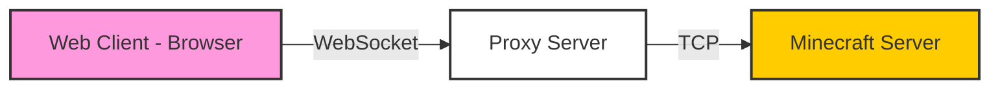

## Overview

Minecraft Web Client can connect to almost any Minecraft Java Edition server running versions **1.8 through 1.21.5**. Since browsers can't directly connect via TCP, the client uses **WebSocket proxy servers** to bridge the connection.

<Note>
  The proxy server acts as a transparent relay - all Minecraft protocol packets are processed directly in your browser without deserialization on the proxy.
</Note>

## Quick Connect

Connect to a server using query parameters:

```
https://mcraft.fun/?ip=hypixel.net&version=1.19.4
```

### Connection Parameters

<ParamField path="ip" type="string" required>
  Server address (with optional port)
  
  Examples:
  - `play.example.com`
  - `mc.server.net:25565`
  - `192.168.1.100:25566`
</ParamField>

<ParamField path="version" type="string">
  Minecraft version to use for connection
  
  Default: Auto-detected or 1.19.4
</ParamField>

<ParamField path="proxy" type="string">
  Proxy server address to use
  
  Default: Built-in proxy server
</ParamField>

<ParamField path="username" type="string">
  Player username (offline mode)
</ParamField>

<ParamField path="name" type="string">
  Server name for saving to server list
</ParamField>

## Proxy Servers

Proxy servers enable browser clients to connect to Minecraft servers by converting TCP connections to WebSockets.

### How Proxies Work

The connection flow looks like this:



<Info>
  All Minecraft protocol packets are processed **in your browser**. The proxy only forwards encrypted data without inspecting it.
</Info>

### Built-in Proxy

The project provides free public proxy servers:

- Default proxy available at the hosted domains
- Handles connections for both online and offline mode servers
- Supports Microsoft authentication for online mode

<Warning>
  Public proxies may have higher latency (200ms+) depending on your location and the server location.
</Warning>

### Custom Proxy Setup

For the best performance, host your own proxy server:

<Steps>
  <Step title="Clone Repository">
    ```bash
    git clone https://github.com/zardoy/minecraft-web-client.git
    cd minecraft-web-client
    ```
  </Step>
  
  <Step title="Install Dependencies">
    ```bash
    pnpm install
    ```
    
    <Info>
      See [CONTRIBUTING.md](https://github.com/zardoy/minecraft-web-client/blob/next/CONTRIBUTING.md) for setup details
    </Info>
  </Step>
  
  <Step title="Start Proxy Server">
    ```bash
    pnpm prod-start
    ```
    
    The proxy will run on port **8080** by default.
  </Step>
  
  <Step title="Connect to Your Proxy">
    ```
    https://mcraft.fun/?proxy=http://localhost:8080
    ```
  </Step>
</Steps>

### Docker Proxy Deployment

Deploy a standalone proxy using Docker:

```bash
docker build . -f Dockerfile.proxy -t minecraft-web-proxy
docker run -p 8080:8080 minecraft-web-proxy
```

<Card title="Deploy to Cloud" icon="cloud" href="https://app.koyeb.com/deploy?name=minecraft-web-client&type=git&repository=zardoy%2Fminecraft-web-client&branch=next&builder=dockerfile&env%5B%5D=&ports=8080%3Bhttp%3B%2F">
  One-click deploy to Koyeb cloud platform
</Card>

### Server-Side Proxy (mwc-proxy)

For server owners, use [mwc-proxy](https://github.com/zardoy/mwc-proxy) to allow direct WebSocket connections:

- Runs alongside your Minecraft server
- Eliminates third-party proxy dependency
- Players connect via `wss://play.example.com`

```javascript
// The client adds ?client_mcraft to identify itself
// From src/customChannels.ts
const isWebSocketServer = (server) => {
  return server.startsWith('ws://') || server.startsWith('wss://')
}
```

## Online Mode Authentication

Connect to online mode servers using Microsoft account authentication.

### Requirements

<Warning>
  Online mode authentication requires:
  - A proxy server that supports authentication endpoints
  - Microsoft account with Minecraft Java Edition license
  - HTTPS connection (Crypto API requirement)
</Warning>

### Authentication Flow

<Steps>
  <Step title="Select Server">
    Choose an online mode server and ensure you're using a compatible proxy.
  </Step>
  
  <Step title="Microsoft Sign-In">
    You'll be prompted to authenticate with Microsoft:
    - A device code will be displayed
    - Visit the authentication URL
    - Enter the code and sign in
  </Step>
  
  <Step title="Token Caching">
    Authentication tokens are cached in your browser:
    - Future connections use cached tokens
    - No need to re-authenticate until tokens expire
  </Step>
  
  <Step title="Join Server">
    The client handles session server validation automatically.
  </Step>
</Steps>

```typescript
// Authentication implementation from src/microsoftAuthflow.ts
const authFlow = {
  async getMinecraftJavaToken () {
    setProgressText('Authenticating with Microsoft account')
    
    await fetch(authEndpoint, {
      method: 'POST',
      headers: { 'Content-Type': 'application/json' },
      body: JSON.stringify({
        ...tokenCaches,
        connectingServer,
        connectingServerVersion
      }),
    })
  }
}
```

### Proxy Authentication Support

The proxy must expose authentication endpoints:

```typescript
// From src/microsoftAuthflow.ts:20
export const getProxyDetails = async (proxyBaseUrl: string) => {
  const url = `${proxyBaseUrl}/api/vm/net/connect`
  const result = await fetch(url)
  const json = await result.json()
  
  // Check for auth capabilities
  authEndpoint = json.capabilities.authEndpoint
  sessionEndpoint = json.capabilities.sessionEndpoint
}
```

<Info>
  If the proxy doesn't support authentication, you'll see: "Selected proxy server does not support Microsoft authentication"
</Info>

## Server Address Parsing

The client supports multiple server address formats:

<Tabs>
  <Tab title="Standard">
    ```
    play.example.com
    mc.server.net:25565
    ```
  </Tab>
  
  <Tab title="With Version">
    ```
    play.example.com:1.19.4
    server.net:25565:1.20.1
    ```
    
    The version is automatically extracted from the address.
  </Tab>
  
  <Tab title="WebSocket">
    ```
    ws://example.com
    wss://secure.server.com
    ```
    
    Direct WebSocket connections (requires mwc-proxy on server).
  </Tab>
  
  <Tab title="IP Address">
    ```
    192.168.1.100
    192.168.1.100:25565
    ```
  </Tab>
</Tabs>

```typescript
// Address parsing from src/parseServerAddress.ts
export const parseServerAddress = (address: string): ParsedServerAddress => {
  // Handle ws:// and wss:// WebSocket addresses
  if (/^ws:[^/]/.test(address)) address = address.replace('ws:', 'ws://')
  if (/^wss:[^/]/.test(address)) address = address.replace('wss:', 'wss://')
  const isWebSocket = address.startsWith('ws://') || address.startsWith('wss://')
  
  // Parse port and version from address
  // Format: host:port:version or host:version:port
}
```

## Connection Options

### Auto-Connect

Enable automatic connection for embedded iframes:

```
?ip=server.com&version=1.19.4&autoConnect=true
```

<Warning>
  Auto-connect must be enabled in `config.json` (`allowAutoConnect: true`)
</Warning>

### Lock Connect Screen

Disable input fields in connect screen (for embedded use):

```
?ip=server.com&version=1.19.4&lockConnect=true
```

This prevents users from changing:
- Server address
- Version
- Proxy settings
- Username

### Add Artificial Latency

Test high-ping scenarios:

```
?addPing=100
```

Adds 100ms to **both directions** (total +200ms to your ping).

## Offline Mode vs Online Mode

<CardGroup cols={2}>
  <Card title="Offline Mode" icon="user">
    - No authentication required
    - Any username allowed
    - Common on cracked servers
    - No Microsoft account needed
  </Card>
  
  <Card title="Online Mode" icon="shield-check">
    - Microsoft authentication required
    - Verified Minecraft account
    - Official servers and most public servers
    - Secure player identity
  </Card>
</CardGroup>

```typescript
// Offline mode example from src/packetsReplay/replayPackets.ts
serverOptions: {
  'online-mode': false,
  // ...
}
```

## Supported Versions

Server versions **1.8 - 1.21.5** are supported through the [Mineflayer](https://github.com/PrismarineJS/mineflayer) library.

<Note>
  First-class tested versions: **1.19.4** and **1.21.4**
  
  Versions below 1.13 may have limited functionality.
</Note>

## Network Performance

### Expected Latency

<ResponseField name="Best Case" type="~40ms">
  Client, proxy, and server all in the same region (e.g., all in Europe)
</ResponseField>

<ResponseField name="Residential Proxy" type="~180ms">
  Using residential IP proxy services
</ResponseField>

<ResponseField name="Worst Case" type="200ms+">
  Client in US, proxy in Europe, server in US (transatlantic double trip)
</ResponseField>

<Info>
  For best performance, host your own proxy in the same region as the server you're connecting to.
</Info>

## Troubleshooting

<AccordionGroup>
  <Accordion title="Connection Timeout">
    **Cause**: Proxy server unreachable or server is down
    
    **Solutions**:
    - Verify the server address is correct
    - Try a different proxy server
    - Check if the Minecraft server is online
  </Accordion>
  
  <Accordion title="Proxy Authentication Failed">
    **Cause**: Proxy doesn't support Microsoft authentication
    
    **Solutions**:
    - Use the default built-in proxy
    - Update your custom proxy to latest version
    - Check proxy capabilities at `/api/vm/net/connect`
  </Accordion>
  
  <Accordion title="Kicked by Server">
    **Cause**: Online mode server rejecting connection
    
    **Solutions**:
    - Ensure you're authenticated with Microsoft account
    - Verify your Minecraft license is valid
    - Check server version compatibility
  </Accordion>
  
  <Accordion title="High Ping / Lag">
    **Cause**: Proxy server far from Minecraft server
    
    **Solutions**:
    - Host your own proxy closer to the server
    - Choose a proxy in the server's region
    - Check your internet connection speed
  </Accordion>
</AccordionGroup>

## Advanced Configuration

### Query Parameter Reference

See [Query Parameters](/reference/query-parameters) for the complete list of connection options.

### Custom Channels

Enable WebSocket-based custom protocol channels:

```javascript
// From src/defaultOptions.ts
customChannels: 'websocket'
```

This enables custom block models and other protocol extensions.